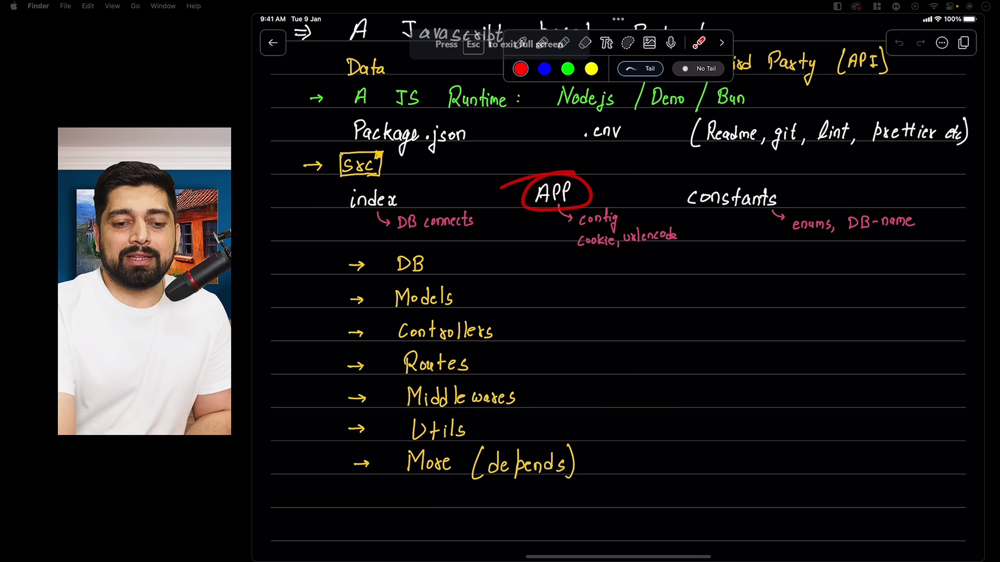

## File structure of backend
### What is a server
- A server is nothing but a piece of code that serves the request of the client.


## Directory structure of backend


- DB -> it will contain the peace of code that connexts the database with the backend as soon as our application/index.js file is run.
- Models -> it will contain the schema of the database.
- Controllers -> it will contain the logic(functions) of the application.
- Routes -> it will contain the routes of the application.
- Middlewares -> it will contain the middlewares of the application.
- Utils -> it will contain the utility functions of the application. like sending emails and all
- Public -> it will contain the static files of the application like images, css, js files.

and many more as per requirements.

## Accepting and reponding to requests
this is done using express js

there has to be someone who is listening to the request sent to the server and that is done by the express js.

### routes
what is a route?
A route is nothing but a path that is used to access the resources of the server.

some types of routes are:
- /: it is the root route of the application. or the home route of the application.
- /login: it is the route that is used to login the user.
## Types of requests
- GET: it is used to get the data from the server. it is mostly used when we browse the website.
- POST: it is used to send the data to the server. it is mostly used when we submit the form.
- PUT: it is used to update the data on the server.
- DELETE: it is used to delete the data from the server.


## Creating package.json using npm init command
don't use npm init -y because it will create the package.json file with the default values.
let's follow a customize approach.
```bash
@UjjwalSharma01 ➜ /workspaces/chai-backend (main) $ npm init
This utility will walk you through creating a package.json file.
It only covers the most common items, and tries to guess sensible defaults.

See `npm help init` for definitive documentation on these fields
and exactly what they do.

Use `npm install <pkg>` afterwards to install a package and
save it as a dependency in the package.json file.

Press ^C at any time to quit.
package name: (chai-backend) ujjwal-backend
version: (1.0.0) 
git repository: 
license: (ISC) 
About to write to /workspaces/chai-backend/package.json:

{
  "name": "ujjwal-backend",
  "version": "1.0.0",
  "description": "a backend at chai aur code channel - youtube",
  "type": "module",
  "main": "index.js",
  "scripts": {
    "dev": "nodemon -r dotenv/config --experimental-json-modules src/index.js"
  },
  "keywords": [
    "javascript",
    "backend",
    "chai"
  ],
  "author": "Hitesh Choudhary",
  "license": "ISC",
  "devDependencies": {
    "nodemon": "^3.0.1",
    "prettier": "^3.0.3"
  },
  "dependencies": {
    "bcrypt": "^5.1.1",
    "cloudinary": "^1.41.0",
    "cookie-parser": "^1.4.6",
    "cors": "^2.8.5",
    "dotenv": "^16.3.1",
    "express": "^4.18.2",
    "jsonwebtoken": "^9.0.2",
    "mongoose": "^8.0.0",
    "mongoose-aggregate-paginate-v2": "^1.0.6",
    "multer": "^1.4.5-lts.1"
  }
}


Is this OK? (yes) yes
```


it will ask other questions also when you will run it for the first time in the environment.

## When you need to define the start command to deploy on server in the package.json file

After this when you will run
```bash
npm run start
``` 
command it will automatically get converted into
```bash
npm index.js
``` 
given that index.js is the file that you have defined in the package.json file. and it's present in the root directory of the project.
or you have defined it with path in the package.json file.
example
```json
{
  "start": "src/index.js"
}
```
