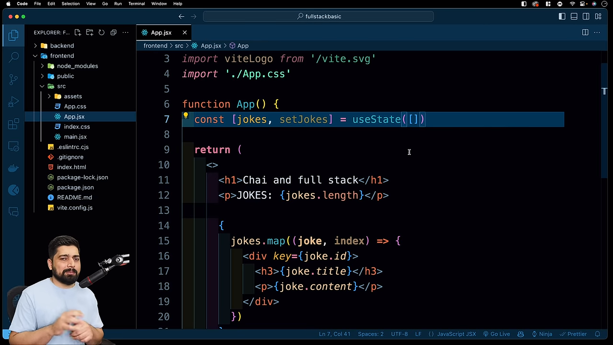
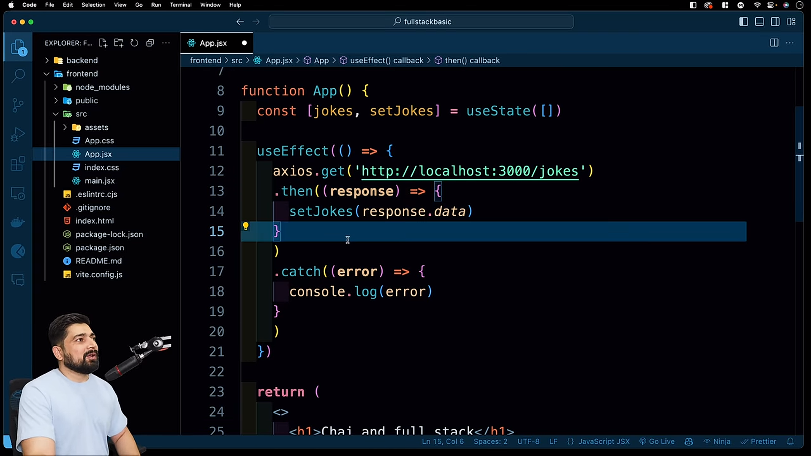
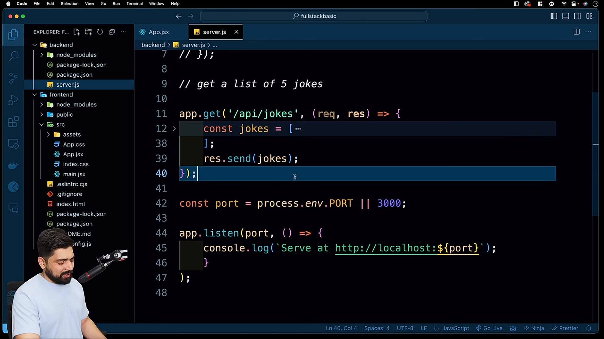
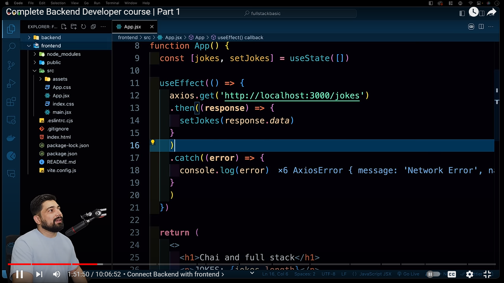
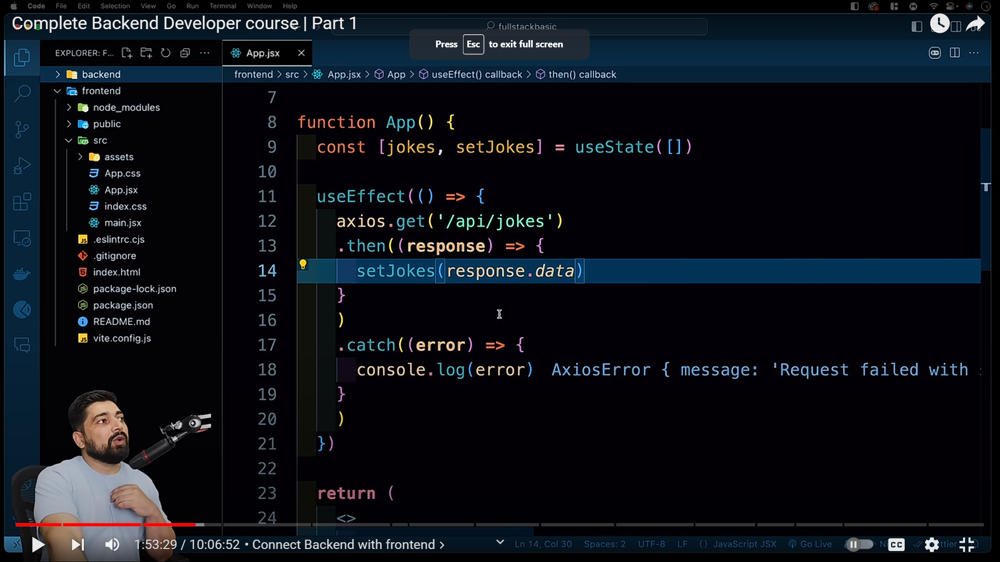
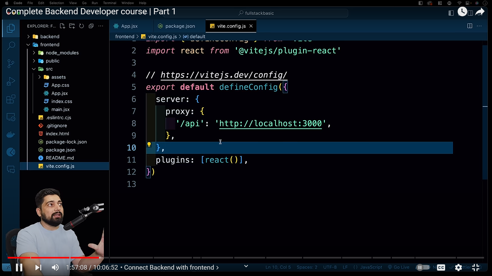

## Module js and common js (way of importing express)
### common js method of importing express
```js
const express = require('express'); // common js -> code comes synchronously you explictly need to define it in package.json to handle it like a module
```
code for package.json
```json
{
  "type": "module"
}
```
### module js method of importing express
```js
import express from 'express'; // module js -> code comes asynchronously 
```

## Connecting to the frontend
we will use vite bundler to connect the frontend with the backend
```bash
npm create vite@latest frontend
npm install
```

using axious to fetch the data from backend


## CORS Issue
CORS stands for Cross-Origin Resource Sharing. It is a security feature implemented by browsers to prevent malicious websites from making requests to your server.
it happens when origin of the request is different from the origin of the server.
### Standarisation 
1. Serving the request using `api/` route

2. Standarisation of routes in the frontend


3. additing of proxy in the vite.config.js or the bundler you are using so that the request is made via server you are using it might be localhost or any other server

automatically localhost will be appended to the request and it and a proxy will be added that the request is made using the `localhost` or the same server you are using. to tackle CORS